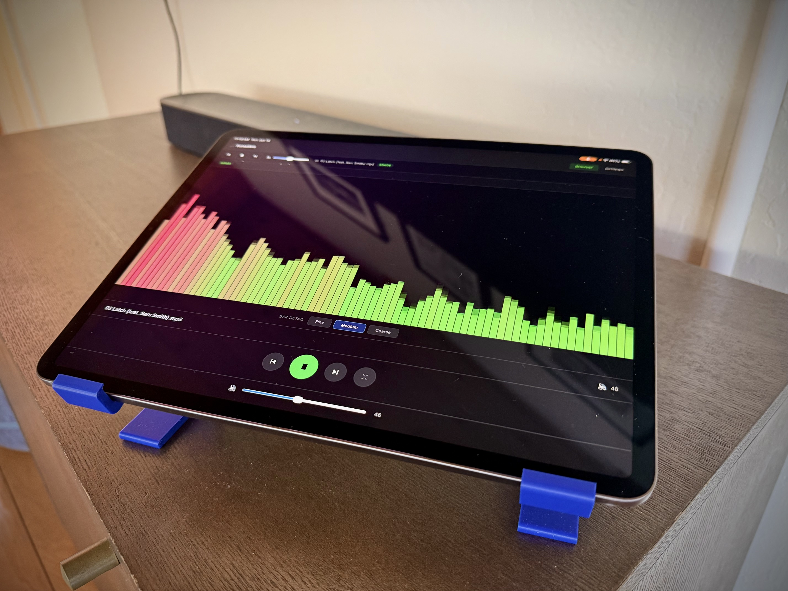

# SonosWeb

A web-based Sonos music controller that lets you browse, search, and play local music files on your Sonos speakers. Music is indexed from an FTP/SFTP server on your LAN, and the web UI provides playback controls, search with metadata support, and a file browser with folder navigation.



## Features

- **Music Browser** — Navigate remote music libraries via FTP/SFTP with breadcrumb folder navigation
- **Search** — Multi-facet search across file names, folder names, and ID3 metadata
- **Sonos Playback** — Play individual tracks or entire folders on your Sonos speakers
- **Playback Controls** — Persistent now-playing bar with play/pause, next/previous, and current track info
- **Settings** — Configure Sonos speaker IP, FTP/SFTP credentials, and trigger re-indexing
- **Background Indexing** — Recursively indexes remote music files into a local SQLite DB with progress indication

## Quick Start

```bash
git clone https://github.com/your-username/sonosweb.git
cd sonosweb
python3 -m venv venv
source venv/bin/activate
pip install -r requirements.txt
uvicorn main:app --host 0.0.0.0 --port 8000 --reload
```

Or use the provided startup script:

```bash
bash app.sh
```

This starts two instances — HTTP on port 8000 (for Sonos playback URLs) and HTTPS on port 443 (for the web UI with the audio visualizer). The HTTPS instance is optional — it's only needed if you want microphone access in the browser for the audio visualizer, since modern browsers block `getUserMedia()` on insecure origins.

## Docker

```bash
docker build -t sonosweb .
docker run -p 8000:8000 -p 443:443 sonosweb
```

> **Note:** The Dockerfile is currently outdated for LAN use. Running directly on the host is recommended when using dual HTTP/HTTPS ports.

## Tech Stack

- **Backend:** Python, FastAPI, Jinja2
- **Frontend:** Vanilla JavaScript, CSS (dark theme)
- **Sonos:** soco library
- **Database:** SQLite via aiosqlite
- **File Transfer:** paramiko (SFTP), ftplib (FTP)
